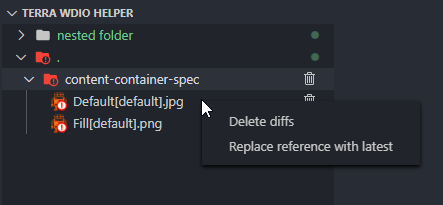

# Terra WDIO Helper

A VSCode extension to help with analyzing test results, specifically screenshots captured by the [terra-toolkit WDIO utility](https://github.com/cerner/terra-toolkit). This extension is aimed at making traversing through screenshots generated by WDIO tests easier and more efficient. The default directory structure generated by WDIO is annoying to traverse every time you want to view screenshots and even more annoying if you want to see the same screenshot across different locales and form factors and even *more* more annoying if you want to manipulate screenshots (delete, copy, etc.). This extension aims to simplify the process of viewing and editing WDIO screenshots in the hopes of preserving engineer sanity.

## Features

- This extension aggregates a screenshot across all locales and form factors and displays them all in a single webview for your viewing pleasure. The diff view adds options for comparing the latest and reference screenshots (inspired by GitHub's image diffing) alongside the diff generated by WDIO.

- Includes menu options for deleting just diffs (if you need to manually clear the diff directory before running tests) and replacing the reference screenshot with the latest (saves you a potentially expensive extra test suite run).

## Extension Settings

This extension contributes the following settings:
- `terraWdioHelper.defaultSnapshotTab`: The tab that will be active upon initial disclosure of the snapshot webview.
- `terraWdioHelper.fallbackSnapshotTab`: The snapshot tab to fallback to if the default snapshot tab is empty.
- `terraWdioHelper.defaultDiffOption`: The diff option that will be selected by default when a diff tab is first activated.
- `terraWdioHelper.testFolderPath`: Relative path to the WDIO test folder. This setting can be applied at a folder level for multi-root workspaces.

## Installation

Terra WDIO Helper can be installed from the VSCode extension marketplace from within the editor itself or from here: https://marketplace.visualstudio.com/items?itemName=juzerzarif.terra-wdio-helper.

## Report Bugs

If and when you find bugs in the extension, please log an issue to this repository with a detailed description, a snapshot of the filesystem, and steps to reproduce. If the bug is with the webview, logging any console messages present in the webview browser console is also appreciated (webview console can be accessed by pressing Ctrl+Shift+P and searching `Open Webview Developer Tools`)

## Requirements

Must utilize terra-toolkit's WDIO utility and configuration to provide the snapshot directory structure expected by the extension.

Minimum required version of VSCode: 1.18.0
