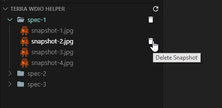
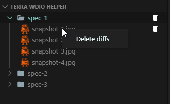

# Terra WDIO Helper

An exension to help with analyzing test results, specifically screenshots captured by the [terra-toolkit WDIO utility](https://github.com/cerner/terra-toolkit). This extension is aimed at making traversing through screenshots generated by WDIO tests easier and more efficient.

## Features

This extension aggregates all snapshots under a spec across all locales and viewports and displays them in a webview for easy access. Enables GitHub style image diffing providing more diff options than the default image diff generated by WDIO.

It also adds the ability to batch delete snapshots and diffs for a spec and a test:

## Requirements

Must utilize terra-toolkit's WDIO configuration and helpers to provide the snapshot directory structure expected by the extension.

## Extension Settings

This extension contributes the following settings:

* `terraWdioHelper.wdioTestFolderRelativePath`: Path to the WDIO test folder relative to the workspace root

## Release Notes

### 0.1.0

Initial development release of terra-wdio-helper
